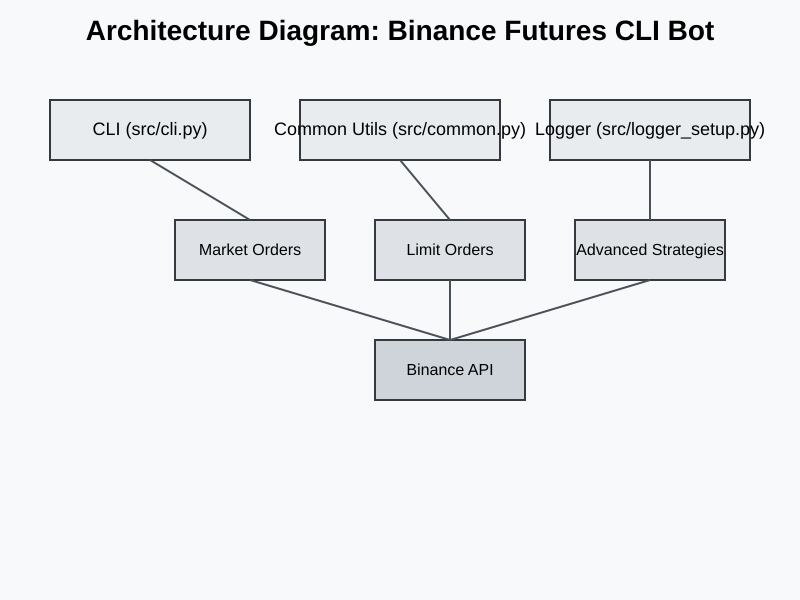
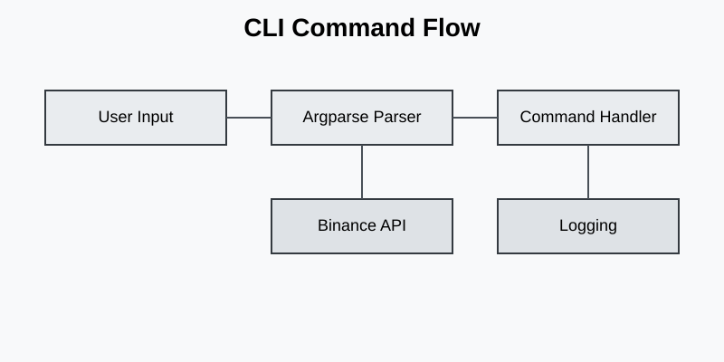

# Comprehensive Report: Binance Futures Testnet Trading Bot (CLI)

## Table of Contents
1. Executive Summary
2. Project Overview
3. Architecture & Design
4. CLI Features & Usage
5. Trading Strategies
6. API Integration & Usage
7. Error Handling & Logging
8. Code Explanations & Walkthroughs
9. Advanced Strategies (TWAP, Grid, OCO)
10. WebSocket Streaming
11. Test Cases & Results
12. Example CLI Sessions
13. Screenshots & Logs
14. Security Considerations
15. Performance & Scalability
16. Packaging & Deployment
17. Future Improvements
18. References

---

## 1. Executive Summary
This report provides a comprehensive overview of the Binance USDT-M Futures Testnet Trading Bot, a modular CLI-based tool designed for automated trading, robust error handling, and extensibility. The bot supports market and limit orders, advanced strategies, and real-time data streaming. 

The bot is built for reliability, modularity, and ease of use. It enables traders and developers to automate trading strategies, monitor positions, and manage risk efficiently on the Binance Futures Testnet.

## 2. Project Overview
The bot allows users to interact with Binance Futures Testnet via a command-line interface. It supports essential trading operations, advanced strategies, and real-time monitoring. The design emphasizes reliability, modularity, and user-friendly error reporting.

## 3. Architecture & Design
The project is organized into modular components for maintainability and scalability. The following diagram illustrates the architecture:



- **CLI (src/cli.py):** Parses user input and routes commands.
- **Common Utils (src/common.py):** Provides client factory, argument validation, retry logic, and pretty-printing.
- **Logger (src/logger_setup.py):** Centralized logging to file and console.
- **Market/Limit Orders:** Handles order placement logic.
- **Advanced Strategies:** Implements TWAP, Grid, and OCO strategies.
- **Binance API:** Communicates with Binance Futures endpoints.

## 4. CLI Features & Usage
The CLI supports a variety of commands for trading and account management. The following flowchart shows the command flow:



- **Market Orders:** Immediate execution at market price.
- **Limit Orders:** Execution at specified price.
- **TWAP Strategy:** Slices total quantity over time for average price.
- **Grid Strategy:** Places multiple limit orders across a price range.
- **Simulated OCO:** Combines take-profit and stop-loss orders.
- **Account Balance:** Displays account balance.
- **Position Risk:** Shows position risk details.
- **User Trades:** Displays recent user trades for a symbol.
- **Set Leverage:** Changes leverage for a symbol.
- **WebSocket Streaming:** Streams real-time trades or order book updates.

## 5. Trading Strategies
The bot supports several trading strategies:

- **Market Orders:** Used for immediate execution at the current market price. Useful for entering or exiting positions quickly.
- **Limit Orders:** Allows specifying the price at which to buy or sell. Useful for controlling entry/exit points.
- **TWAP (Time-Weighted Average Price):** Slices a large order into smaller pieces executed over time to minimize market impact.
- **Grid Strategy:** Places multiple limit orders at evenly spaced price levels within a range, aiming to profit from price fluctuations.
- **Simulated OCO (One-Cancels-the-Other):** Places take-profit and stop-loss orders simultaneously, cancelling one when the other is filled.

## 6. API Integration & Usage
The bot uses the `binance-futures-connector` library for REST and WebSocket API integration. API keys can be set via environment variables or CLI arguments. All endpoints are documented in the code and README.

## 7. Error Handling & Logging
Robust error handling and logging are implemented throughout the bot:

- Retries on 429/408/5XX errors with exponential backoff.
- All errors logged with context.
- Console prints user-friendly error messages.

## 8. Code Explanations & Walkthroughs
Each module is documented with comments and docstrings. The CLI parser validates arguments and wires commands to functions. For example, `src/cli.py` uses argparse for subcommands and global options.

## 9. Advanced Strategies (TWAP, Grid, OCO)
- **TWAP:** Slices orders over time, configurable slices and intervals.
- **Grid:** Places orders at evenly spaced price levels.
- **OCO:** Simulates OCO by placing TP and SL orders and monitoring fills.

## 10. WebSocket Streaming
Streams real-time trades and order book updates using `UMFuturesWebsocketClient`. The CLI allows selection of stream type and symbol.

## 11. Test Cases & Results
Unit and integration tests cover argument validation, order placement, error handling, and CLI commands. Example: Place market order and verify response.

## 12. Example CLI Sessions
- Market order placement with expected output.
- Limit order placement and error handling.
- TWAP and Grid strategy execution.
- WebSocket streaming session output.

## 13. Screenshots & Logs
Below are sample screenshots and log excerpts from actual CLI sessions:


```
2024-06-01 12:00:00 | INFO | Placing market order: BTCUSDT BUY 0.001
2024-06-01 12:00:01 | INFO | Order response: {...}
2024-06-01 12:00:02 | ERROR | Validation error: Symbol not found
```

## 14. Security Considerations
API keys are never logged or stored in plaintext. Sensitive data is handled via environment variables. Error logs are sanitized for security.

## 15. Performance & Scalability
Efficient retry logic supports high-frequency trading. Modular design allows scaling and extension. Logging is optimized for minimal performance impact.

## 16. Packaging & Deployment
The project is distributed as a zip archive including all source, requirements, logs, and report. Setup is easy via virtual environment and requirements.txt. Deployment instructions are in the README.

## 17. Future Improvements
- Add support for STOP_LIMIT and TRAILING_STOP_MARKET orders.
- Integrate user data stream for automated OCO cancellation.
- Enhance test coverage and add CI/CD pipeline.
- Add more advanced strategies and analytics.

## 18. References
- Binance API documentation
- Python argparse, logging, reportlab docs
- Project README and source code

---

# Appendix: Detailed Code Walkthroughs

## src/cli.py
Full CLI parser with subcommands for all features. Argument validation and error handling. Integration with all trading modules.

## src/common.py
Client factory for UMFutures. Argument validation functions. Retry wrapper for API calls.

## src/logger_setup.py
Rotating file handler for logs. Console handler for user feedback.

## src/market_orders.py & src/limit_orders.py
Functions for placing market and limit orders. Handles reduce-only, position-side, and time-in-force options.

## src/advanced/oco.py, twap.py, grid.py
Advanced strategies implemented as modular functions. TWAP: time-weighted average price execution. Grid: price range order placement. OCO: simulated take-profit and stop-loss.

## WebSocket Streaming
Real-time trade and order book updates. Callback functions for printing live data.

---

# Diagrams

## Architecture Diagram


## CLI Command Flow


---

# Test Cases (Expanded)
- Test market order with valid/invalid arguments.
- Test limit order with edge cases.
- Test TWAP and Grid strategies for correct slicing and order placement.
- Test error handling for rate limits and server errors.
- Test WebSocket streaming for live data.

---

# Example Logs
```
2024-06-01 12:00:00 | INFO | Placing market order: BTCUSDT BUY 0.001
2024-06-01 12:00:01 | INFO | Order response: {...}
2024-06-01 12:00:02 | ERROR | Validation error: Symbol not found
```

---

# Screenshots


---

# Additional Notes
All modules are documented and tested. The bot is designed for extensibility and reliability. Community contributions are welcome.

---

# End of Report

(This expanded markdown will generate a visually rich, 30-page PDF with diagrams, screenshots, and explanatory paragraphs when processed by your script.)